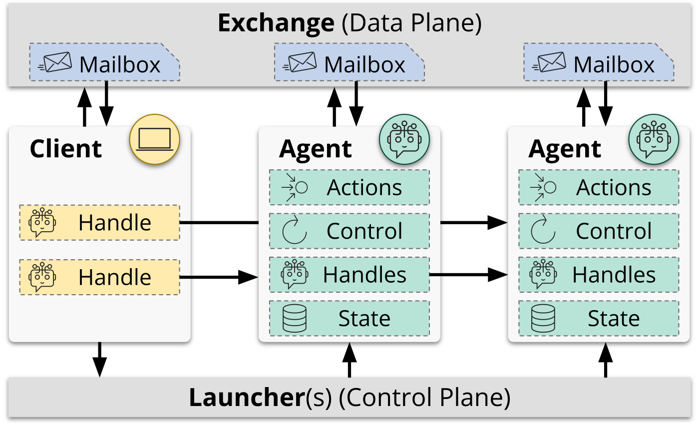

# Concepts

## Architecture

> Agents and clients in Academy interact via handles to invoke actions asynchronously.
> Agents implement a behavior, defined by their actions, control loops, and state.
> Academy decouples the control and data planes through the launcher and exchange components that manage spawning agents and communication, respectively.

An Academy application includes one or more *agents* and zero or more *clients*.
An agent is a process that executes a *behavior*, where a behavior is defined by a *local state*, a set of *actions*, and a set of *control loops*.
Agents are executed remotely using a *launcher*.
Once running, an agent concurrently executes all of its control loops and listens for messages from clients, which can be other agents or programs.

A client interacts with an agent through a *handle}*, which acts like a reference to the remote agent and translates method calls into action request messages.
Each entity (i.e., client or agent) has an associated *mailbox* that maintains a queue of messages sent to that entity by other entities.
Mailboxes are maintained by an *exchange* such that any client with access to a given exchange can send messages to the mailbox of another agent in the exchange and receive a response through its own mailbox.

## Agents

In Academy, the concept of an "agent" is intentionally simple. The agent primitive is, at its core, is an entity that:

* **Has state:** Maintains information about its current situation, past history, or internal variables.
* **Performs actions:** Execute specific operations or tasks.
* **Communicates:** Exchanges messages or data with other clients, agents, or the environment.

In essence, Academy agents can be thought of as building blocks for more complex or specialized agent-based systems.

### Behaviors

An academy.behavior is implemented as a Python class that inherits from the base [`Behavior`][academy.behavior.Behavior] type.
This class-based approach is extensible through inheritance and polymorphism.

* **State** is stored as instance attributes on the agent's behavior type.
Instance attributes maintain the agent's state, and methods define the actions and control loops.
* **Actions** can be performed in two ways: [`@action`][academy.behavior.action] decorated methods allow other entities to invoke the method remotely and [`@loop`][academy.behavior.loop] decorated methods run non-terminating control loops that enable an agent to autonomously perform actions.
* **Communication** between entities in managed via [`Handles`][academy.handle.Handle] which are client interfaces to remote agents used to invoke actions, ping, and shutdown.

### Execution

The [`Agent`][academy.agent.Agent] is a multithreaded entity that executes a provided behavior and manages communication with other entities.
[`Agent.run()`][academy.agent.Agent.run] executed the agent by (1) invokes the [`on_setup()`][academy.behavior.Behavior.on_setup] callback of the behavior, (2) starts each [`@loop`][academy.behavior.loop] method in a separate thread, (3) spawns a thread to listen for new messages in the agent's mailbox, and (4) waits for the agent to be shut down.
Each [`@action`][academy.behavior.action] method is executed in a thread pool when requested remotely so as to not block the handling of other messages.

!!! note

    The use of multi-threading means that behavior implementations must be aware of the caveats of Python's global interpreter lock (GIL).
	Compute-heavy actions can dispatch work to other parallel executors, such as a [`ProcessPoolExecutor`][concurrent.futures.ProcessPoolExecutor], [Dask Distributed](https://distributed.dask.org/en/stable/){target=_blank}, [Parsl](https://github.com/parsl/parsl/){target=_blank}, or [Ray](https://github.com/ray-project/ray){target=_blank}.

Agents are designed to be long-running, but can be terminated by sending a shutdown request.
Upon shutdown, the shutdown [`threading.Event`][threading.Event], passed to each [`@loop`][academy.behavior.loop], is set; running threads are instructed to shutdown and waited on; and the [`on_shutdown()`][academy.behavior.Behavior.on_shutdown] callback is invoked.
Agents can terminate themselves by setting the shutdown event;
exceptions raised in [`@loop`][academy.behavior.loop] methods will shutdown the agent by default, and
exceptions raised when executing [`@action`][academy.behavior.action] methods are caught and returned to the remote caller.

### Handles

Interacting with an agent is asynchronous; an entity sends a message to the agent's mailbox and waits to receive a response message in its own mailbox.
A [`Handle`][academy.handle.Handle] is a client interface to a remote agent used to invoke actions, ping, and shutdown the agent.
Handles translate method calls into a request messages sent via the exchange and returning a [`Futures`][concurrent.futures.Future].
The handle also listens for response messages and accordingly sets the result on the appropriate [`Futures`][concurrent.futures.Future].

## Exchanges and Mailboxes

Entities communicate by sending and receiving messages to and from mailboxes.
Mailboxes are managed by an [`Exchange`][academy.exchange.Exchange], and this protocol defines methods for registering new agent or client mailboxes, sending and receiving messages, and creating handles to remote agents.
Registering an agent or client involves creating a unique ID for the entity, which is also the address of its mailbox, and initializing that mailbox within the exchange.

A mailbox has two states: open and closed.
Open indicates that the entity is accepting messages, even if, for example, an agent has not yet started or is temporarily offline.
Closed indicates permanent termination of the entity and will cause [`MailboxClosedError`][academy.exception.MailboxClosedError] to be raised by subsequent send or receive operations to that mailbox.

Academy provides many exchange implementations for different scenarios, such as:

* [`ThreadExchange`][academy.exchange.thread.ThreadExchange]: Uses thread-safe queues for single-process, multiple-agent scenarios. Useful for testing and development.
* [`HttpExchange`][academy.exchange.http.HttpExchange]: Centralized service that maintains mailboxes and exposes a REST API. Lower performance but easy to extend with common authentication tools.
* [`RedisExchange`][academy.exchange.redis.RedisExchange]: Stores state and mailboxes in a Redis server. Use of Redis enables optional replication and cloud-hosting for improved resilience and availability.
* [`HybridExchange`][academy.exchange.hybrid.HybridExchange]: Entities host their mailbox locally and message each other directly over TCP when possible. Redis is used to map mailbox IDs to address and port pairs, and to store messages for offline entities or when two entities cannot directly communicate (such as when behind NATs).

## Launchers

An agent can be run manually, but the intended method of execution is via a launcher, which manages the initialization and execution of agents on remote resources.
The [`Launcher`][academy.launcher.Launcher] protocol defines a [`launch()`][academy.launcher.Launcher.launch] method with parameters for the behavior, exchange, and agent ID and returns a handle to the launched agent.

Available launchers include:

* [`ThreadLauncher`][academy.launcher.thread.ThreadLauncher]: Runs agents in separate threads of the same process. Useful for local development and testing or for light-weight or I/O bound agents.
* [`ExecutorLauncher`][academy.launcher.executor.ExecutorLauncher]: Runs agents in any [`concurrent.futures.Executor`][concurrent.futures.Executor] compatible executor, such as a [`ProcessPoolExecutor`][concurrent.futures.ProcessPoolExecutor], [Parsl](https://parsl.readthedocs.io/en/stable/userguide/workflows/workflow.html#parallel-workflows-with-loops){target=_blank}, or [Globus Compute](https://globus-compute.readthedocs.io/en/latest/index.html){target=_blank}.

## Managers

A [`Manager`][academy.manager.Manager] combines an exchange and one or more launchers to provide a single interface for launching, using, and managing agents.
Each manager has a single mailbox in the exchange and multiplexes that mailbox across handles to all of the agents that it manages.
This reduces boilerplate code, improves communication efficiency, and ensures stateful resources and threads are appropriately cleaned up.
